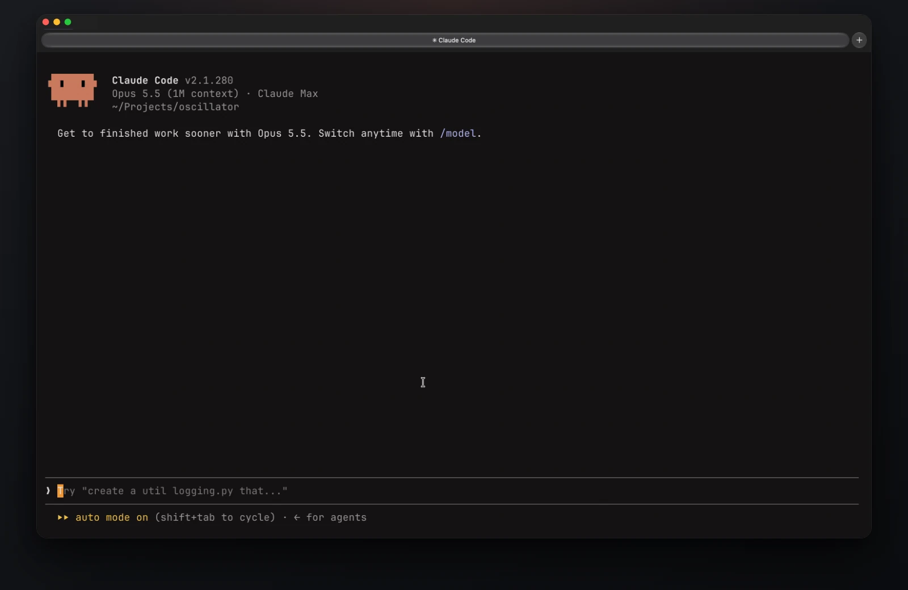
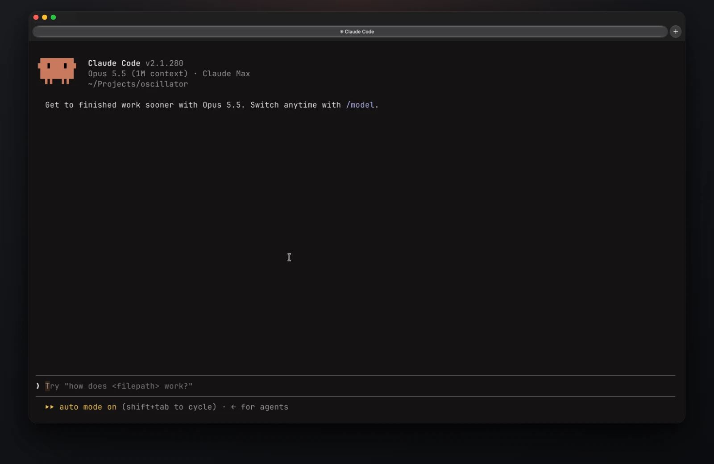
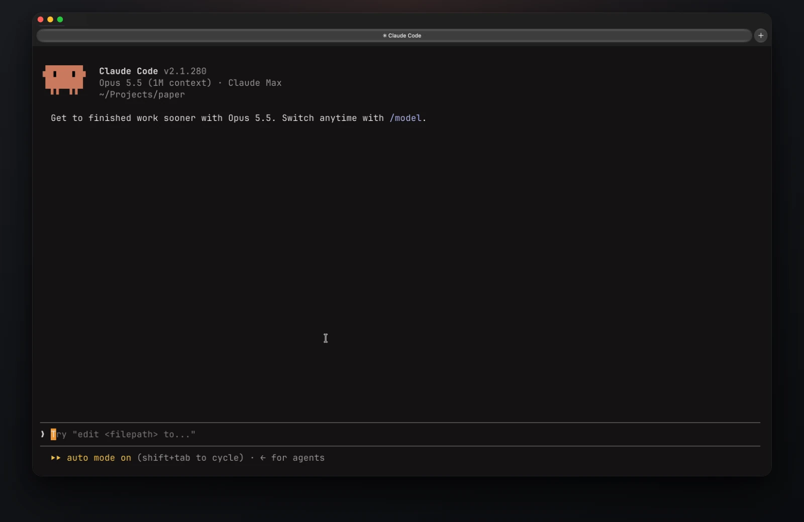
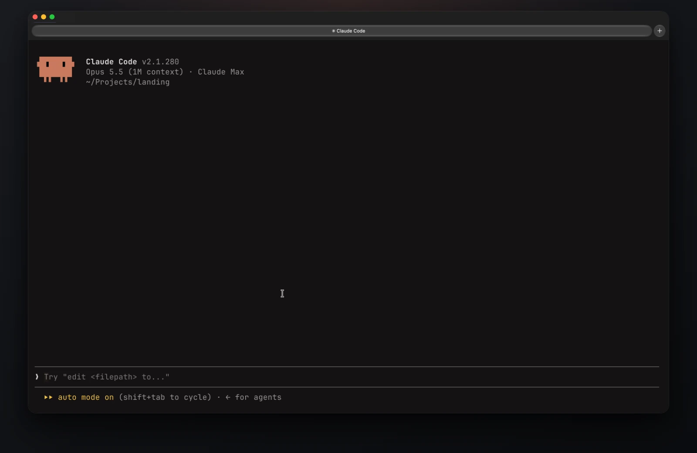
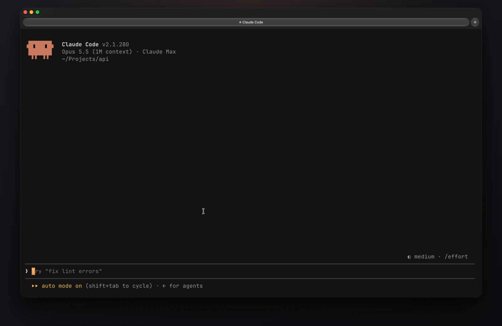
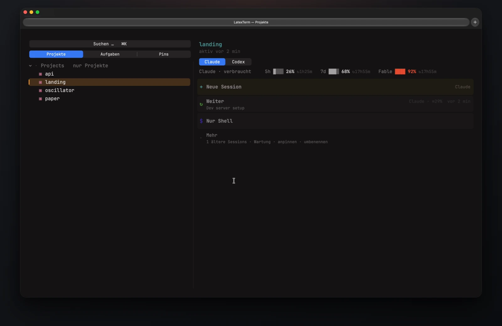

# LatexTerm

[](#install)
[](https://swift.org)
[](LICENSE)

**A native macOS terminal for working with Claude Code and Codex.** Panes that aren't only terminals —
sketches, PDFs, live web pages — sit next to the chat, and math renders as math.



<sub>Real sessions, recorded in LatexTerm. Only the waiting while Claude thinks is cut out.</sub>

## Sketch it, hand it over

Draw on the **scratchpad**, press ➤ — the sketch lands in Claude's prompt as an image. Claude draws the clean
version straight back onto the pad.



## Your PDF, next to the chat

Claude compiles and opens the **preview**. Mark a passage, add a note, send — with page, source line and a
crop. The PDF reloads in place when the fix lands.



## Your site, live

Dev server in one pane, the page in a **web** pane. ⌥-click any element and `⇧⌘⏎` hands it to Claude — with
selector and source line. Agents see and click the page themselves.



## Claude starts Claudes

Ask for parallel work and it happens side by side. Every pane reports what it is doing in the title bar;
unwatched panes send a notification when they finish or need you.



## Home: every project, every session

`⌘N` opens Home: projects, sessions, quotas. Resume where you left off, or just start typing to search across
sessions and open one beside the other. Claude and Codex are equal citizens.



## Also in the box

- **LaTeX over the terminal text** — `$…$`, `$$…$$`, `\(…\)`, `\[…\]` render with KaTeX exactly on their characters.
  Hover to enlarge, click to pin and copy as **LaTeX**, readable Unicode, PNG, vector PDF or Markdown; ✎ edits a
  formula and types it into your prompt.
- **Auto-tiling panes and tabs** — `⌘T` splits into a balanced grid, `⌘⏎` zooms, `⌥⌘R` restarts and brings every
  pane and agent session back.
- **Built for agents** — a `latexterm` CLI and an MCP server let Claude and Codex open panes, start and ask other
  sessions, and look at what a pane shows. → [docs/agents.md](docs/agents.md)
- **Looks like Ghostty** — Ghostty themes and one-click config import. → [docs/appearance.md](docs/appearance.md)
- **Desktop widgets** for quotas, what's due and today's numbers.

The interface is German for now.

## Install

Grab `LatexTerm.app` from [**Releases**](https://github.com/MatsLuca/LatexTerm/releases), unzip, drop into
`/Applications`. The build is not notarized — on first launch open **System Settings → Privacy & Security → Open
Anyway**, or:

```sh
xattr -dr com.apple.quarantine /Applications/LatexTerm.app
```

Let agents drive it (optional):

```sh
ln -s /Applications/LatexTerm.app/Contents/Helpers/latexterm /opt/homebrew/bin/latexterm
claude mcp add -s user latexterm -- /opt/homebrew/bin/latexterm mcp
```

Home reads its projects from an external `projekte --json` command; without it the pane shows a hint and nothing
else breaks. Codex status hooks: [docs/agents.md](docs/agents.md#codex-status-setup).

<details>
<summary><b>Build from source</b></summary>

Needs Xcode 26+ with the Metal Toolchain (`xcodebuild -downloadComponent MetalToolchain`).

```sh
open LatexTerm.xcodeproj    # then Cmd+R  (App Sandbox is off on purpose: PTY rights)

# CLI build + tests
xcodebuild -project LatexTerm.xcodeproj -scheme LatexTerm -configuration Release \
  -derivedDataPath .build CODE_SIGNING_ALLOWED=NO build
xcodebuild test -project LatexTerm.xcodeproj -scheme LatexTerm \
  -destination 'platform=macOS' CODE_SIGNING_ALLOWED=NO
bash scripts/test-regressions.sh
```

</details>

<details>
<summary><b>Shortcuts</b></summary>

| | |
|---|---|
| `⌘N` | new **Home** pane |
| `⌘T` / `⌘W` | new shell pane (inherits the folder) / close pane |
| `⇧⌘T` | new tab |
| `⌘1…9` | grow the grid to N panes |
| `⌘⏎` | zoom the focused pane |
| `⇧⌘⏎` | hand the sketch, marked passage or picked element to the agent |
| `⌘F` | find in the focused pane |
| `⌘+` `⌘-` `⌘0` | font size |
| `⌘L` | toggle formula overlays |
| `⌘,` | settings |
| `⌥⌘R` / `⌥⌘Q` | restart / quit and keep panes — agent sessions resume, shells return to their folder |

</details>

## License

MIT — © 2026 Mats Luca Dagott. Bundles [SwiftTerm](https://github.com/migueldeicaza/SwiftTerm) (MIT, vendored fork
at `SwiftTermLocal/`), [KaTeX](https://katex.org) 0.16.47 (MIT; fonts under SIL OFL 1.1) and
[JetBrains Mono](https://github.com/JetBrains/JetBrainsMono) NL 2.304 (SIL OFL 1.1) — see [`NOTICE`](NOTICE).
The clips are real screen recordings, edited with [Remotion](https://remotion.dev) (`demo-video/`).
