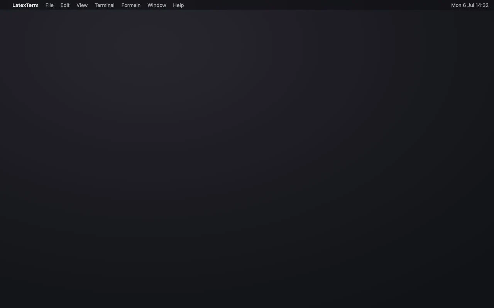

# LatexTerm

[](#install)
[](https://swift.org)
[](LICENSE)

A native macOS terminal that renders LaTeX live over the text — and doubles as a cockpit for **Claude Code** sessions.



## Highlights

- **Live LaTeX overlays** — formulas between `$…$`, `$$…$$`, `\(…\)`, `\[…\]` render as KaTeX exactly on their source characters. No OCR: a vendored SwiftTerm fork exposes the real cell grid.
- **Hover, pin & export** — hover shows a formula full-size; a click pins it with copy buttons: **LaTeX**, **readable Unicode** (`(-b ± √(b²-4ac))/(2a)`), **PNG**, **vector PDF**, **Markdown**.
- **Edit loop** — ✎ opens the formula in an inline editor with live preview; Enter types the result into your prompt.
- **Auto-tiling panes** — ⌘T splits into a balanced grid, ⌘⏎ zooms one pane, layout + working dirs survive a relaunch.
- **Claude Code cockpit** — every pane knows whether its agent is working, done, or waiting for input, notifies you, and picks up the session's `/color` as its accent. Agents drive the terminal themselves via the `latexterm` CLI.
- Plus: ⌘F search, KaTeX errors underlined instead of swallowed, overlays that follow the scroll, a native settings window (⌘,).

## Why

The predecessor ([LatexTerminalLive](https://github.com/MatsLuca/LatexTerminalLive)) read another terminal's screen with OCR — too flaky for greek glyphs and fractions. LatexTerm *is* the terminal, so formula positions come straight from the cell grid. Owning the grid paid off twice: the same buffer access now powers the Claude Code session detection.

<details>
<summary><b>How the LaTeX overlay works</b></summary>

```
PTY (login shell) → SwiftTerm VT parser → buffer grid
      → OverlayController scans visible rows
      → LaTeXDetector finds delimited formulas
      → one shared WKWebView + KaTeX renders each as a positioned <div>
```

- One WebView hosts *all* formulas; KaTeX loads once, offline (bundled CSS/JS/fonts).
- Overlays are keyed to the absolute scrollback row — scrolling repositions them (one GPU-composited translate) instead of rebuilding.
- Detection handles soft-wrapped inline formulas and multi-line `$$ … $$` blocks; inline hits scale to fit their row.
- Clicks on empty space pass through to normal terminal selection; only formula hitboxes are interactive.

The deep-dive lives in the source — start at `LatexTerm/Latex/OverlayController.swift`.

</details>

## Claude Code integration

Everything here is a plain terminal mechanism — escape sequences, an env var, a Unix socket. Nothing is hardwired to Claude; any agent or script can use the same channels.

### Home pane — project launcher (`⌘N`)

The first pane on launch (and every `⌘N`) is a **home pane** instead of a shell: one list of your projects sorted by last Claude Code activity — name, alias, age, and the title of the last session (from Claude Code's own `ai-title` entries). `⏎` starts Claude in the project, `→` opens that project's sessions as a list (`⏎` resumes, `←` back), `⌥⏎` gives a plain shell, typing filters, `⌘⇧N` creates a new project folder and hands it to `/neues-projekt`. The pane turns into a normal terminal on selection. `⌘T` stays a plain shell inheriting the focused pane's CWD.

The data comes from an external CLI — `projekte --json` (run through your login shell; override with `defaults write com.… LatexTerm.projekteCommand "…"`). Without it the pane shows a hint and nothing else breaks. The contract (JSON shape) lives with the CLI, not in the app.

### Status & notifications

Each pane tracks its session: **working** (titlebar dot pulses, a floating pill in the pane shows the current tool live) → **done** / **needs input** (macOS notification if the pane is unwatched; clicking it focuses and zooms the pane).

- **Precise:** Claude Code hooks write `\e]5522;status=working|input|done[;detail]\a` to the pane's tty — `detail` (e.g. the tool name from a `PreToolUse` hook) becomes the pill text.
- **Zero-config fallback:** the pane detects spinner vs. input box straight from the buffer grid; a fresh hook signal silences it for 10 minutes (hooks win, the fallback self-heals crashed sessions).
- Terminal bell (`\a`) and OSC 777 (`\e]777;notify;Title;Body\a`) notify instantly too.

### Per-pane accent color

The pane accent (caret, border, titlebar dot) follows the session — passively from Claude Code's `/color` frame, or explicitly, even through SSH:

```sh
printf '\e]5522;accent=#e85e3e\a'   # set this pane's accent
printf '\e]5522;accent=reset\a'     # back to global/adaptive
```

### The `latexterm` CLI

Agents (or you) can drive the terminal from any shell — the app listens on a per-user socket (0600 + peer check, see [SECURITY.md](SECURITY.md)):

```sh
latexterm list-panes [--json]                     # index, UUID, CWD, session state
latexterm new-pane [--cwd DIR] [--exec CMD]
latexterm send [--pane SEL] [--no-enter] TEXT...  # type into a pane (Enter by default)
latexterm zoom [--pane SEL]
latexterm focus [--pane SEL]
```

Without `--pane`, the calling shell's own pane is targeted (via `$LATEXTERM_PANE_ID`). Put the bundled binary on your PATH once:

```sh
ln -s /Applications/LatexTerm.app/Contents/Helpers/latexterm /opt/homebrew/bin/latexterm
```

That closes the loop: a Claude Code session can open panes, start fresh Claudes in them, prompt them, and watch their status — Claude orchestrating Claude.

## Install

Grab `LatexTerm.app` from [**Releases**](https://github.com/MatsLuca/LatexTerm/releases), unzip, drop into `/Applications`. The build is unsigned — right-click → **Open** on first launch, or:

```sh
xattr -dr com.apple.quarantine /Applications/LatexTerm.app
```

<details>
<summary><b>Build from source</b></summary>

Needs Xcode 26+ with the Metal Toolchain (`xcodebuild -downloadComponent MetalToolchain`).

```sh
open LatexTerm.xcodeproj    # then Cmd+R  (App Sandbox is off on purpose: PTY rights)
```

```sh
# CLI build + tests
xcodebuild -project LatexTerm.xcodeproj -scheme LatexTerm -configuration Release \
  -derivedDataPath .build CODE_SIGNING_ALLOWED=NO build
xcodebuild test -project LatexTerm.xcodeproj -scheme LatexTerm \
  -destination 'platform=macOS' CODE_SIGNING_ALLOWED=NO
```

</details>

## Shortcuts

| | |
|---|---|
| `⌘N` | new **home pane** (project launcher) |
| `⌘T` / `⌘W` | new shell pane (inherits CWD) / close pane |
| `⌘1…9` | grow the grid to N panes |
| `⌘⏎` | zoom the focused pane (toggle) |
| `⌘F` | find in the focused pane |
| `⌘+` `⌘-` `⌘0` | font size (all panes, persisted) |
| `⌘L` | toggle formula overlays |
| `⌘⇧+` `⌘⇧-` `⌘⇧0` | line spacing |
| `⌥⌘+` `⌥⌘-` `⌥⌘0` | formula render scale |
| `⌘,` | settings window (everything above as sliders) |

**Tip — testing formulas:** zsh `echo` mangles backslashes; use `printf '%s\n' '$E=mc^2$'` or a quoted here-doc.

## Known limitations

- A formula whose opener is scrolled off above the viewport (or that wraps past the bottom) isn't detected; multi-line `$$` blocks need each delimiter alone on its line.
- Two bare `$` in prose (`echo $PATH and $HOME`) still pair into a false formula — every safe heuristic broke legit math, so math correctness wins.
- No live theme sync; colors are captured per rescan.

## License

MIT — © 2026 Mats Luca Dagott. Bundles [SwiftTerm](https://github.com/migueldeicaza/SwiftTerm) (MIT, vendored fork at `SwiftTermLocal/`) and [KaTeX](https://katex.org) 0.16.9 (MIT; fonts under SIL OFL 1.1) — see [`NOTICE`](NOTICE). The demo above is rendered programmatically with [Remotion](https://remotion.dev) (`demo-video/`).
